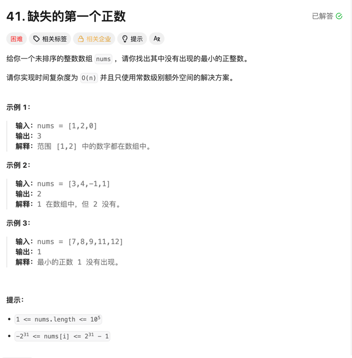

### 第一个缺失的正数

### 题目


### 思考
- 直接哈希： 本题可以直接使用哈希表来存储数组中出现的正整数，然后从1开始遍历，找到第一个没有出现的正整数。但是这种方法需要额外的空间，空间复杂度为O(n)。
- 由于题目要求使用常数级别的空间复杂度，可以使用官解中的标记法，第一遍先将数组中小于0的数置为一个大N的数，N为数组长度。第二遍将小于等于N的数对应的索引位置的数置为负数，最后一遍遍历数组，找到第一个正数的位置即为缺失的正整数。

### 代码
```go
func firstMissingPositive(nums []int) int {
	//第一遍，将小于0的标记为N=1
	n := len(nums)
	for i := 0; i < n; i++ {
		if nums[i] <= 0 {
			nums[i] = n + 1
		}
	}

	//将小于n的标记为负数
	for i := 0; i < n; i++ {
		num := abs(nums[i])
		if num <= n {
			nums[i] = -nums[i]
		}
	}

	for i := 0; i < n; i++ {
		if nums[i] > 0 {
			return i
		}
	}

	return n + 1
}

func abs(a int) int {
	if a < 0 {
		return -a
	}
	return a
}
```