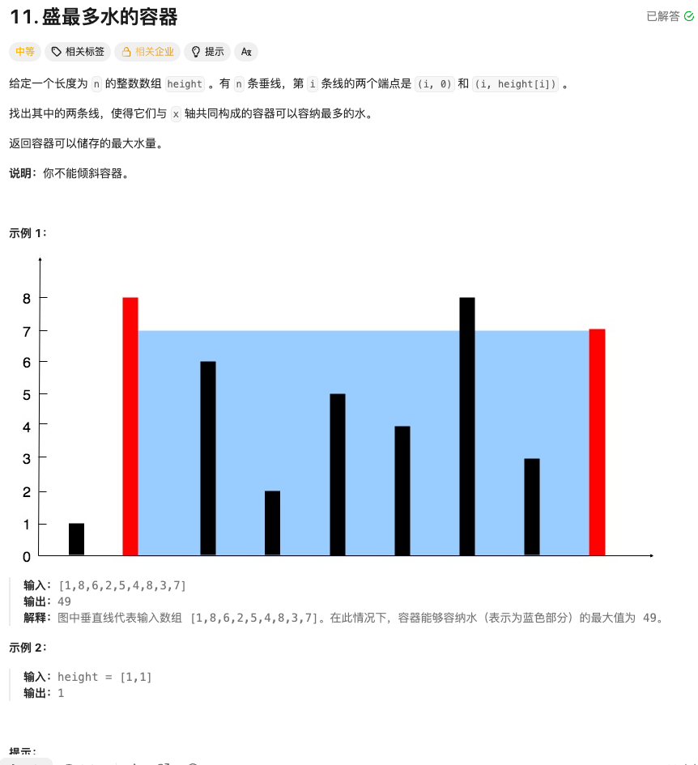

#### 盛水最多的容器


#### 思考
这道题可以使用双指针的方法来解决。我们可以从数组的两端开始，计算当前容器的面积，并根据较短的边移动指针，以期找到更大的面积。
- 初始化两个指针，分别指向数组的左右两端
- 计算当前容器的面积，并更新最大面积
- 移动较短边的指针，尝试找到更大的面积
- 重复上述步骤，直到两个指针相遇
 
这种方法的时间复杂度为O(n)，因为每个元素最多被访问两次（一次由左指针，一次由右指针）。

#### 代码
```go
func maxArea(height []int) int {
	left, right := 0, len(height)-1
	maxArea := 0

	for left < right {
		h := min(height[left], height[right])
		w := right - left
		area := h * w
		if area > maxArea {
			maxArea = area
		}

		if height[left] < height[right] {
			left++
		} else {
			right--
		}
	}

	return maxArea
}

func min(a, b int) int {
	if a < b {
		return a
	}
	return b
}
```