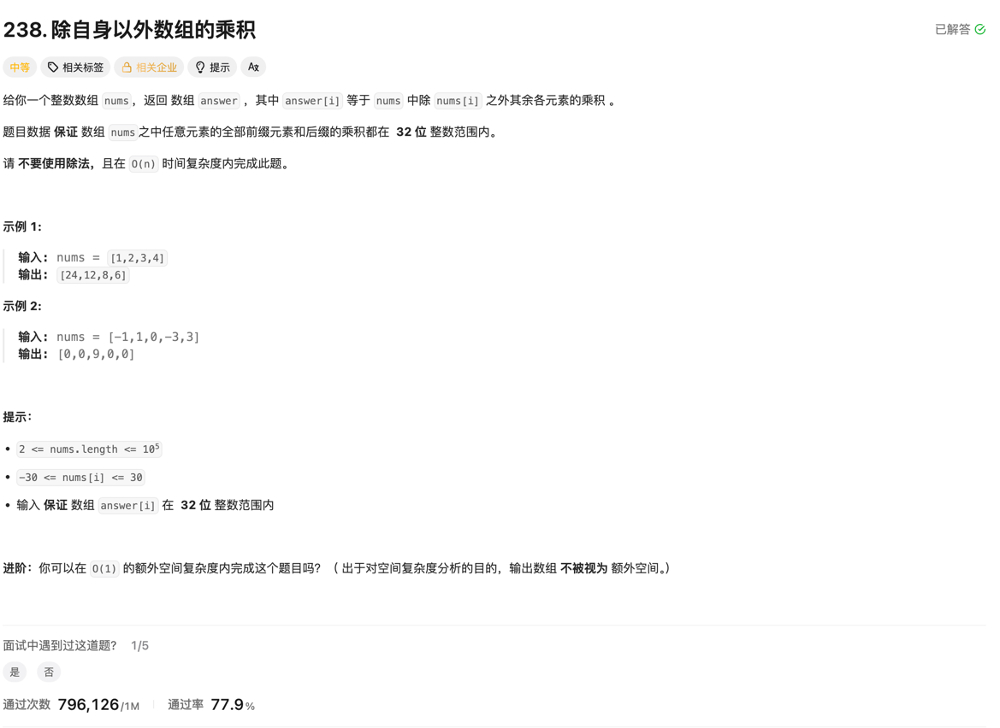

### 238. 除自身以外数组的乘积

### 题目

### 思考
本题不能用除法, 所以求一个数组中每个元素的左侧乘积和右侧乘积, 然后相乘即可， 由于输出的数组不算进空间复杂度，所以可以直接在输出数组中存储左侧乘积，然后再遍历一次数组，计算右侧乘积并更新输出数组即可。
这样就只用了O(1)的空间复杂度，时间复杂度是O(n)。

### 代码
```go
func productExceptSelf(nums []int) []int {
	left := make([]int, len(nums))
	right := make([]int, len(nums))

	left[0] = 1
	for i := 1; i < len(nums); i++ {
		left[i] = nums[i-1] * left[i-1]
	}

	right[len(nums)-1] = 1
	for i := len(nums) - 2; i >= 0; i-- {
		right[i] = nums[i+1] * right[i+1]
	}

	ans := make([]int, len(nums))

	for i := 0; i < len(nums); i++ {
		ans[i] = left[i] * right[i]
	}

	return ans
}
```