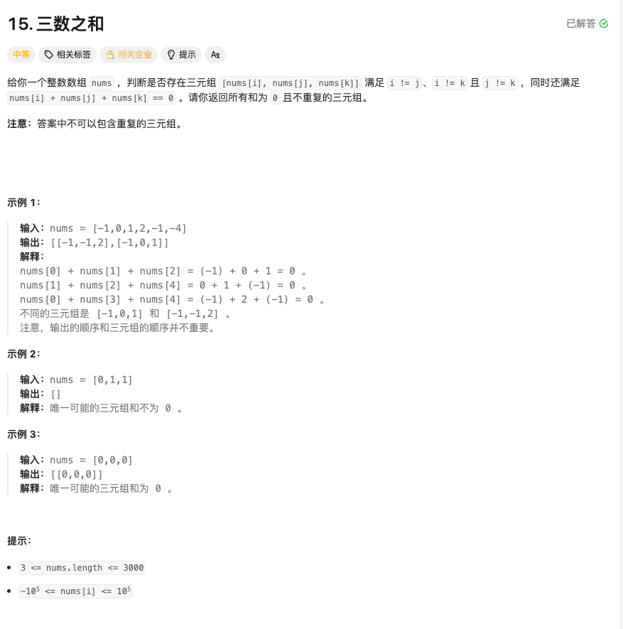

### 三数之和

#### 思考
本题考查的是经典的双指针写法，但第一感觉这个题与两数之和有点相似，可以套用两数之和来求解，但代码写下来能通过，但耗时较高。
本题主要核心点在于过滤，因为会有很多重复的元组出现，可以使用唏希表来保存已经操作过的三元组，但key值需要排序，每次枚举过来都需要重新排序，时间复杂度较高， 
考虑使用双指针，首先对所有元组从小到大排序， 三元组中a + b + c = 0， 则第一层循环避免不了， 枚举a，过滤则可以在循环内部与前一个值比较，如果相等，则代表已经在枚举过了，直接跳过即可。
对于第二层、第三层里，在a不变的情况下， 如果b越大，则c越小才能保证a + b + c = 0， 即第二层从小到大枚举， 第三层则是从大到小，对于这种两种顺序的指针的情况，就可以考虑使用双指针。 
左指针从前向后遍历，右指针从后向前， nums[left] + nums[right] > target， 则需要将right向左移， 反之将left 向右移。

````go
func threeSum(nums []int) [][]int {
var ans [][]int
n := len(nums)
sort.Ints(nums)

for i := 0; i < n; i++ {
if i > 0 && nums[i] == nums[i-1] {
continue
}
target := -nums[i]
//从左循环
right := n - 1
for left := i + 1; left < n; left++ {
if left > i+1 && nums[left] == nums[left-1] {
continue
}

for left < right && nums[left]+nums[right] > target {
right--
}

if left == right {
break
}

if nums[left]+nums[right] == target {
ans = append(ans, []int{nums[i], nums[left], nums[right]})
}
}
}

return ans
}


````