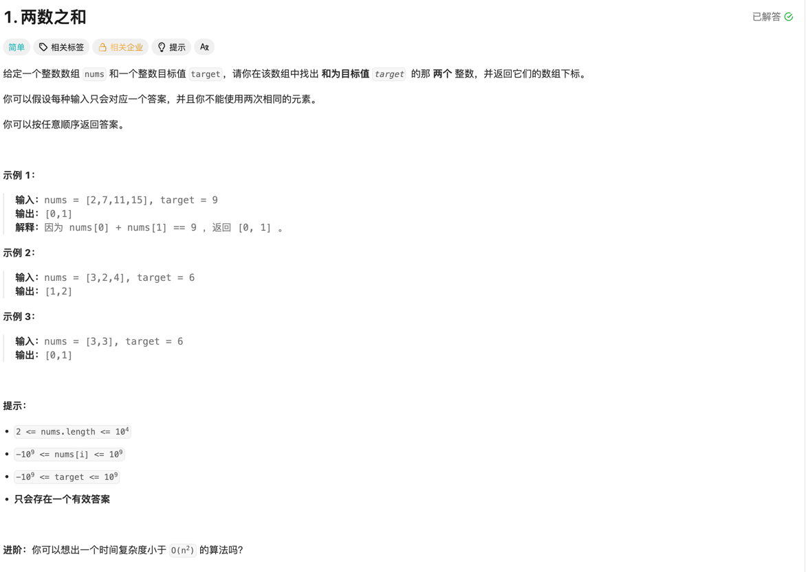

## 题解分析

### 数组篇

#### NO1. 两数之和

##### 思考:

本题直觉可以通过暴力解法解出，但是时间复杂度较高是O(N2), 考虑使用哈希表来操作，将时间复杂度降到O(N).
由于不用考虑返回下标顺序，则直接定义一个map[int]int， 其中key值是nums[i]的值， map的value是nums[i]所在的数组下标，
在一次循环里，直接枚举nums， 针对每一个nums的值，直接在map里去寻找有没有对应的target-nums[i]的值即可， 如果存在，则当前num[i]
的下标值和map里对应的target-nums[i]的值就组成了一对答案， 由于题目中说明符合要求的题解只有一个，则直接返回即可。
