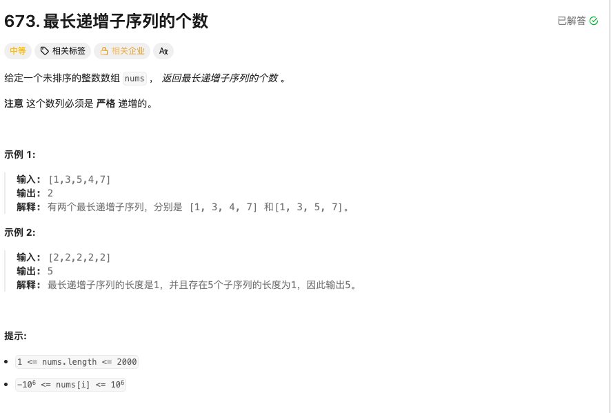

### findNumberOfLIS

### 题目


### 本题要求解的是最长递增子序列的个数，而NO.300要求解的是最长递增子序列的长度，二者思路类似，都是动态规划。所以直接在300题的基础之上加一个一维数据来存储每一个数量对应的个数即可。

### 分析 
dp[i]代表的是以nums[i]结尾的最长递增子序列的长度， count[i]则是以nums[i]结尾的最长递增子序列的个数。
两层循环，外层遍历每一个元素，内层遍历当前元素之前的所有元素， 如果nums[i] > nums[j]，说明可以在nums[j]后面接上nums[i]的元素形成新的最长子序列
dp[i] = max(dp[i], d[j] + 1), 这里是要和所有前边的元素比较，取出最长的那个最长子序列，count[i] =count[j]，因为nums[i]可以接在nums[j]后面形成新的最长子序列，所以count[i] = count[j]， 如果dp[i] == dp[j] + 1, 
说明nums[i]接在nums[j]后面形成的最长子序列和之前的最长子序列长度相同，说明又多了一种方式可以形成最长子序列，所以count[i] += count[j]。
```go
func findNumberOfLIS(nums []int) int {
	var ans int

	//dp[i]表示以nums[i]结尾时最长递增子序列的长度
	dp := make([]int, len(nums))
	//count[i]表示以nums[i]结尾时最长递增子序列的个数
	count := make([]int, len(nums))
	maxLen := 0
	for i := 0; i < len(nums); i++ {
		dp[i] = 1
		count[i] = 1

		// 1,3,5,4,7
		for j := 0; j < i; j++ {
			if nums[i] > nums[j] {
				if dp[j]+1 > dp[i] {
					dp[i] = dp[j] + 1
					count[i] = count[j] // 重新计数
				} else if dp[j]+1 == dp[i] {
					count[i] += count[j]
				}
			}
		}

		if dp[i] > maxLen {
			maxLen = dp[i]
			ans = count[i]
		} else if dp[i] == maxLen {
			ans += count[i]
		}
	}

	return ans
}
```