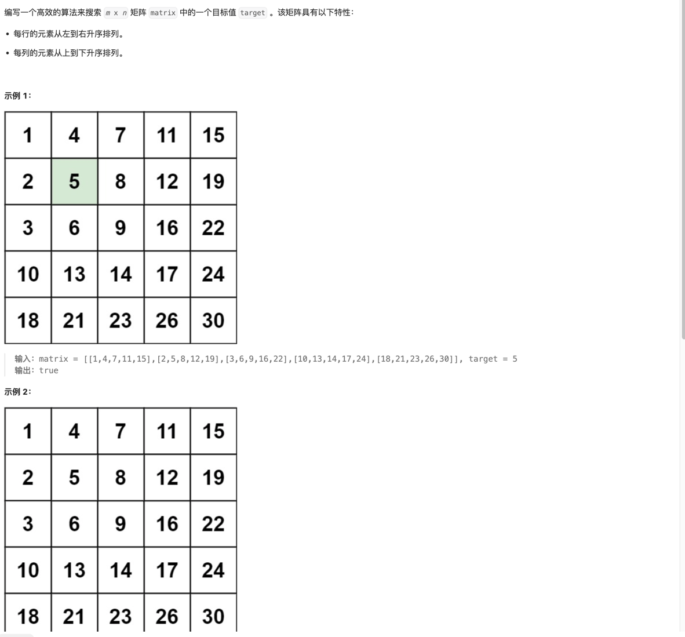

### 240. 搜索二维矩阵 II

### 题目


### 思考 
- 题目要求在一个二维矩阵中搜索一个目标值，矩阵的每一行和每一列都是递增排序的。可以直接遍历每一行，使用二分查找来提高效率。
- 时间复杂度为 O(m log n)，其中 m 是矩阵的行数，n 是矩阵的列数。

```go
func searchMatrix(matrix [][]int, target int) bool {
	for row := range matrix {
		if search(matrix[row], target) {
			return true
		}
	}

	return false
}

func search(nums []int, target int) bool {
	if len(nums) == 0 {
		return false
	}
	mid := len(nums) / 2
	if nums[mid] == target {
		return true
	}

	if nums[mid] > target {
		return search(nums[:mid], target)
	} else {
		return search(nums[mid+1:], target)
	}

	return false
}

```