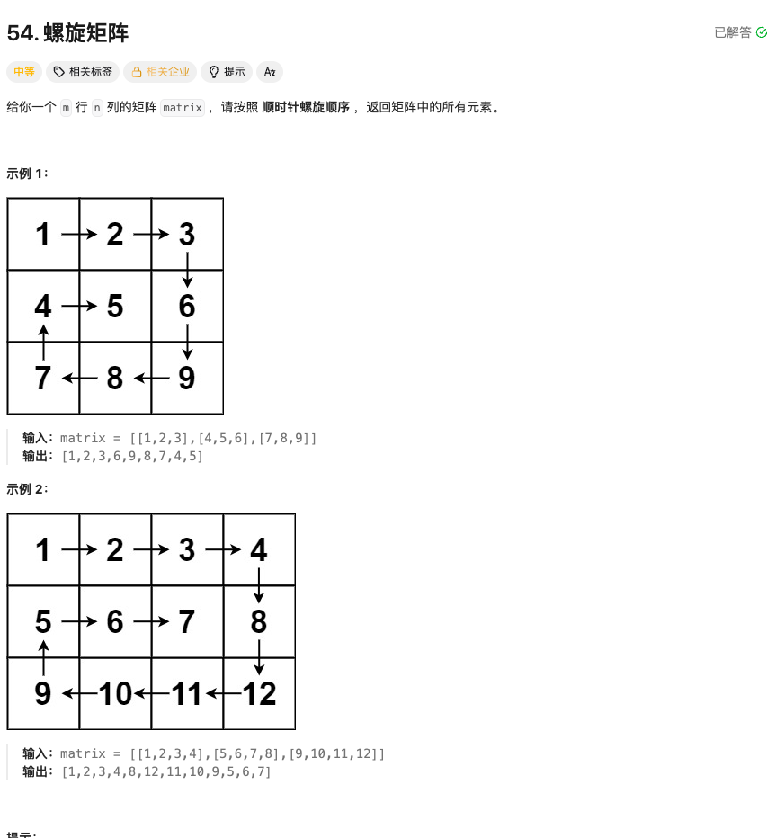

### 螺旋矩阵

### 题目


### 思考 
1. 题目要求我们按顺时针螺旋顺序返回矩阵中的所有元素, 我们可以通过维护四个边界来实现这一点: 上边界 (top), 下边界 (bottom), 左边界 (left), 右边界 (right).
2. 初始时, 上边界为 0, 下边界为矩阵的最后一行索引, 左边界为 0, 右边界为矩阵的最后一列索引.
3. 设计一个count数，通过count + 1对方向取模来控制下一个方向，方向依次为右、下、左、上， 当遇到边界或者已经访问过的元素时，改变方向。

### 代码实现
```go
func spiralOrder(matrix [][]int) []int {
	var ans []int
	visited := make([][]bool, len(matrix))
	for i := range visited {
		visited[i] = make([]bool, len(matrix[0]))
		for j := 0; j < len(matrix[0]); j++ {
			visited[i][j] = false
		}
	}

	directions := [][]int{{0, 1}, {1, 0}, {0, -1}, {-1, 0}} // 右，下，左，上
	rows, cols := len(matrix), len(matrix[0])

	count := 0
	//从0, 0开始向右，遇到边界或者已经访问过的元素就转向
	for i, j := 0, 0; i <= rows && j <= cols; {
		if len(ans) == rows*cols {
			break
		}
		dr := directions[count%4]
		ni, nj := i+dr[0], j+dr[1]
		if i >= 0 && i < rows && j >= 0 && j < cols && !visited[i][j] {
			ans = append(ans, matrix[i][j])
			visited[i][j] = true
		}

		if ni < 0 || ni >= rows || nj < 0 || nj >= cols || visited[ni][nj] {
			count++
			continue
		}

		i, j = ni, nj
	}
	return ans
}
```