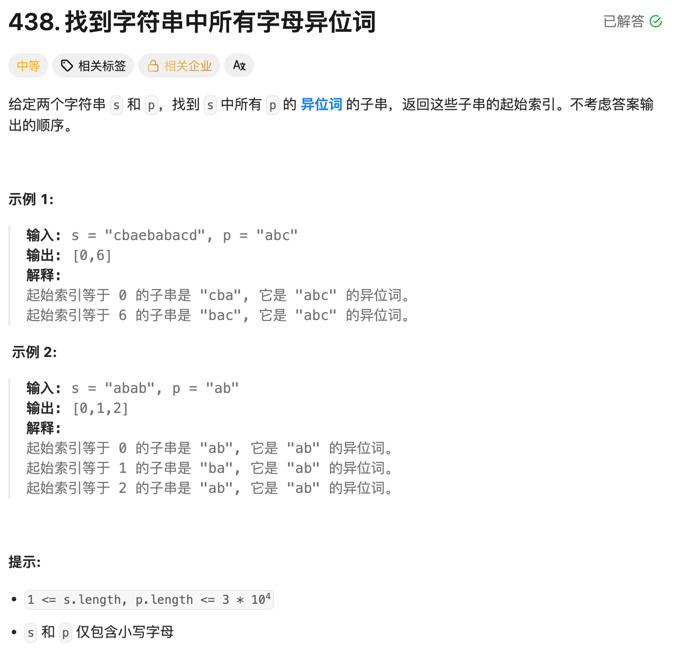

### 寻找字符串是所有字母异位词的起始索引



#### 思考
很自然想得到使用滑动窗口的解法。我们可以使用两个计数器来记录目标字符串和当前窗口中字符的频率，然后逐步移动窗口并比较两个计数器。
我这边使用的是map来保存目标串中字符出现的个数，同时使用另一个map来保存当前窗口中字符出现的个数。每次移动窗口时，更新当前窗口的计数器，并与目标字符串的计数器进行比较。如果两个计数器相等，则说明找到了一个字母异位词的起始索引。
但使用map来保存字符频率会带来额外的空间开销。我们可以使用一个固定大小的数组（长度为26，假设只包含小写字母）来替代map，从而减少空间复杂度。
- 使用map时在checkEqual函数中需要遍历map来比较两个计数器，这样会增加时间复杂度
- 使用一个一维数组来保存字符频率，可以通过一个计数器来跟踪当前窗口中与目标字符串匹配的字符数量，从而避免每次都需要遍历整个数组进行比较。

#### 代码
```go
func findAnagrams(s string, p string) []int {
	var ans []int
	length := len(p)
	left, right := 0, 0
	mp := make(map[byte]int, 1)
	for i := 0; i < len(p); i++ {
		mp[p[i]]++
	}

	check := func(m1, m2 map[byte]int) bool {
		for k, v := range m1 {
			if v2, ok := m2[k]; !ok || v2 != v {
				return false
			}
		}

		return true
	}

	ms := make(map[byte]int, 1)
	for right < len(s) {
		if right-left+1 <= length {
			ms[s[right]]++
		}

		if right-left+1 == length {
			if check(ms, mp) {
				ans = append(ans, left)
			}
			ms[s[left]]--
			if ms[s[left]] == 0 {
				delete(ms, s[left])
			}
			left++
		}
		right++
	}

	return ans
}
```
优化后
```go
func findAnagrams(s string, p string) []int {
	var ans []int
	sLen, pLen := len(s), len(p)
	if sLen < pLen {
		return ans
	}
	scount, pcount := [26]int{}, [26]int{}
	for i := 0; i < pLen; i++ {
		scount[s[i]-'a']++
		pcount[p[i]-'a']++
	}

	if scount == pcount {
		ans = append(ans, 0)
	}

	for i, v := range s[:sLen-pLen] {
		scount[v-'a']--
		scount[s[i+pLen]-'a']++
		if scount == pcount {
			ans = append(ans, i+1)
		}
	}
	return ans
}
```
