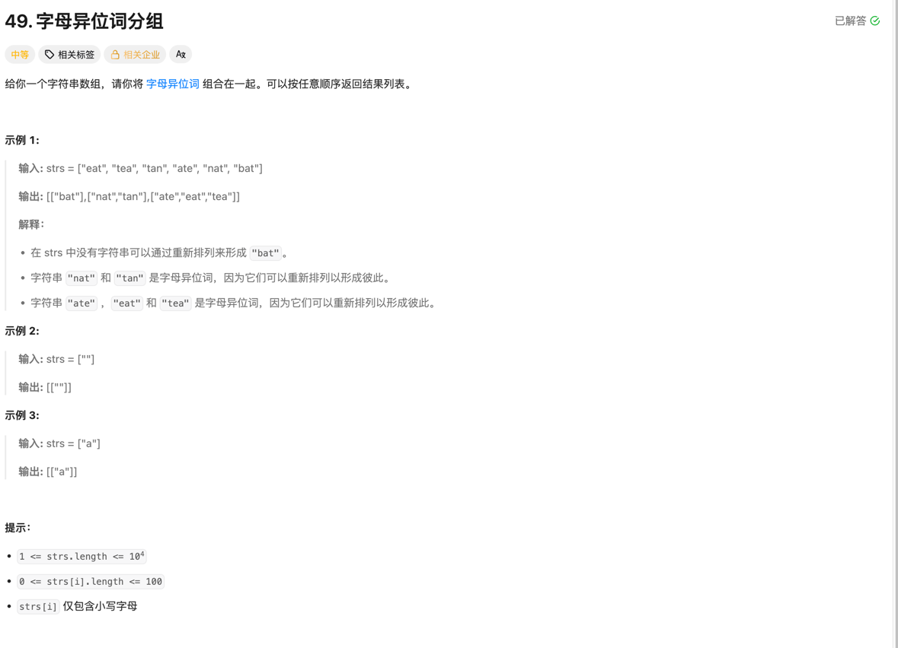

//NO.49


#### 字母异位词
#####  思考
本题可以直接使用暴力解法，利用两层循环，枚举数组中所有数进行分组，但会有超时的问题出现，因为时间复杂度是O(N<sup>2</sup>), 试图通过剪枝等方式，还是会超时。 

##### 优化
使用哈希表：可以定义一个map[string][]string， 用异位词排序之后的字符串做为key，将所有的异位词放到map的values的数组里。
这样只需要一遍for循环，就将所有的值保存到map里，典型的以空间换时间， 优化之后的时间复杂度为O(N).最后直接再循环map，将最终结果取回。

```go
// NO.49 暴力解法
func groupAnagrams2(strs []string) [][]string {
	//用来记录已经分类过
	m := make(map[string]bool, 1)
	var ans [][]string

	for i := 0; i < len(strs); i++ {
		if m[strs[i]] {
			continue
		}
		runes := []rune(strs[i])
		var path []string
		path = append(path, strs[i])
		sort.Slice(runes, func(i, j int) bool {
			return runes[i] < runes[j]
		})

		for j := i + 1; j < len(strs); j++ {
			runes2 := []rune(strs[j])
			sort.Slice(runes2, func(i, j int) bool {
				return runes2[i] < runes2[j]
			})

			if string(runes) == string(runes2) {
				path = append(path, strs[j])
				m[strs[j]] = true
			}
		}

		ans = append(ans, path)
	}

	return ans
}

```

优化后: 
````go
func groupAnagrams(strs []string) [][]string {
	//用来记录已经分类过
	m := make(map[string][]string, 1)
	var ans [][]string

	for i := 0; i < len(strs); i++ {
		key := []rune(strs[i])
		sort.Slice(key, func(i, j int) bool {
			return key[i] < key[j]
		})

		if _, ok := m[string(key)]; !ok {
			m[string(key)] = []string{strs[i]}
			continue
		} else {
			m[string(key)] = append(m[string(key)], strs[i])
		}
	}

	for _, v := range m {
		ans = append(ans, v)
	}
	return ans
}
````