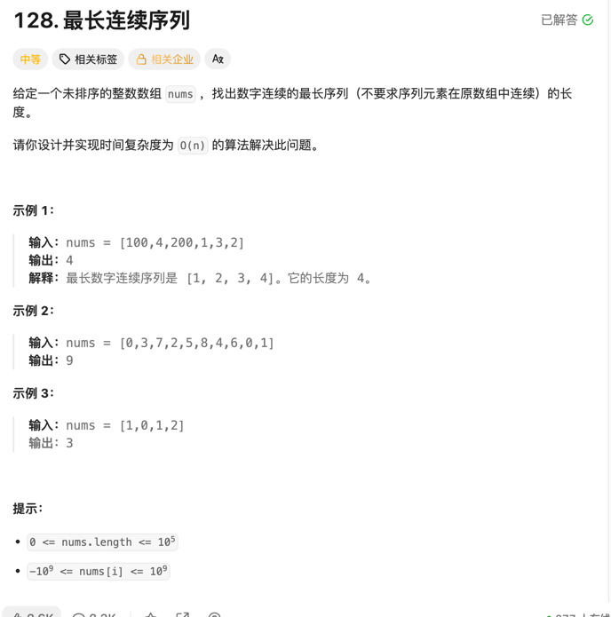

### 最长连续序列

#### 思考：此题其实不是特别容易，至少是我做第二遍的时候，还是会提交容易超时，另外要考虑的点是数组是无序
且可能有负数存在，所以首选想到的方法就是使用哈希表将数据保存起来，然后从最小的元素开始枚举，遇到非连续中断，重置
start和end，来获取最大的连续长度， 但这样提交上来就会超出时间限制。因为时间复杂度变成了O(N2).
这时就需要剪枝，我们可以在外层循环里迭代map， 在第二层循环里，因为nums的长度为n的话，连续的序列最长也就为n， 
最关键的一点就是，在外层的map迭代里，要从一个不含有nums[i] -1的值开始遍历，这样就剪枝成功了，否则还是会提交超时。
