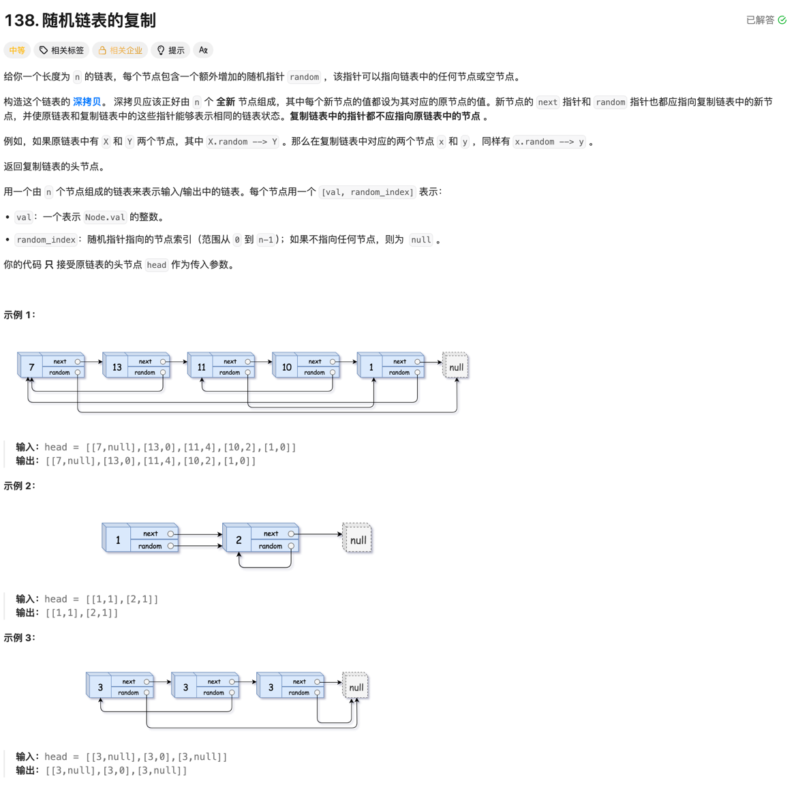

### 138. 随机链表的复制

### 题目

### 思考
- 这道题目中，链表的每个节点除了有一个 next 指针指向下一个节点，还有一个 random 指针指向链表中的任意节点或者 null。要求我们复制这个链表，并且保证新链表中的节点的 next 和 random 指针都正确指向对应的新节点。
- 方法一： 使用回溯+哈希的方式，递归遍历链表的每个节点，使用哈希表记录已经复制过的节点，避免重复复制， 在回溯过程中，构建next和random指针。关键点是先构建，再构建指针，这样可以避免指针指向错误的问题。

### 代码
```go

type Node struct {
	Val    int
	Next   *Node
	Random *Node
}

var cacheNodes map[*Node]*Node

// NO.138
func copyRandomList(head *Node) *Node {
	cacheNodes = make(map[*Node]*Node)
	return deepCopy(head)
}

// NO.138
func deepCopy(node *Node) *Node {
	if node == nil {
		return nil
	}
	if newNode, ok := cacheNodes[node]; ok {
		return newNode
	}
	newNode := &Node{Val: node.Val}
	cacheNodes[node] = newNode
	//在回溯的过程中，构建 next 和 random 指针
	newNode.Next = deepCopy(node.Next)
	newNode.Random = deepCopy(node.Random)
	return newNode
}
```