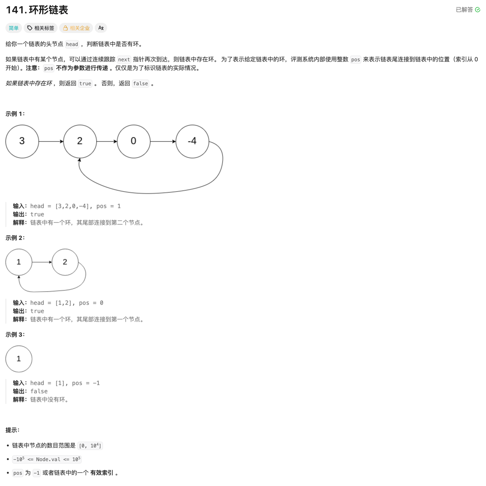

### 判断一个链接里是否有环

### 题目


### 思考
- 链表中有环，说明链表中某个节点的 next 指针指向了前面某个节点，直接使用快慢指针，如果快慢指针相遇，说明有环。

### 代码
```go
func hasCycle(head *ListNode) bool {
	slow, fast := head, head

	for slow != nil && slow.Next != nil && fast != nil && fast.Next != nil {
		if slow == fast {
			return true
		}

		slow = slow.Next
		fast = fast.Next.Next
	}

	return false
}
```